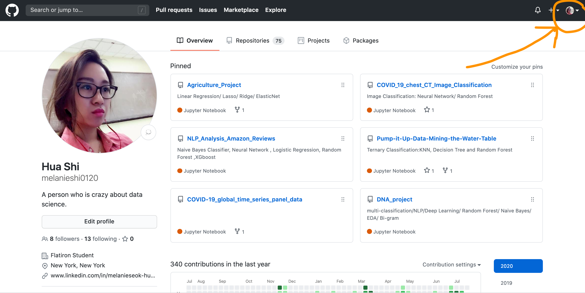
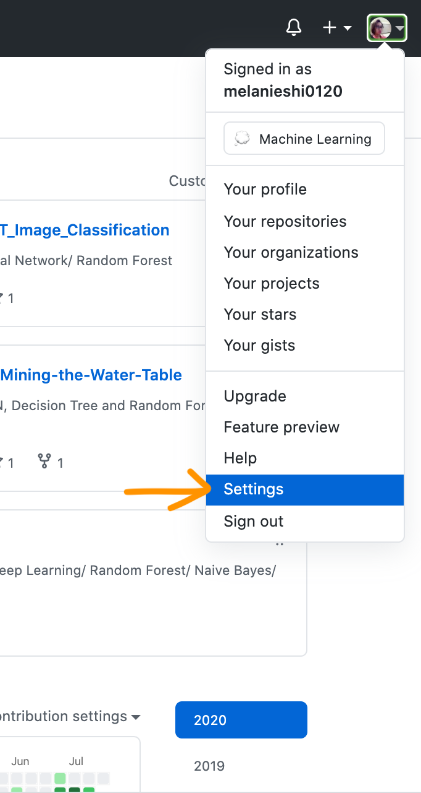
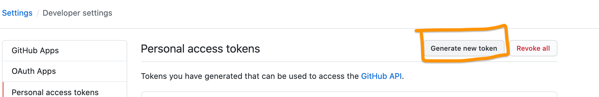
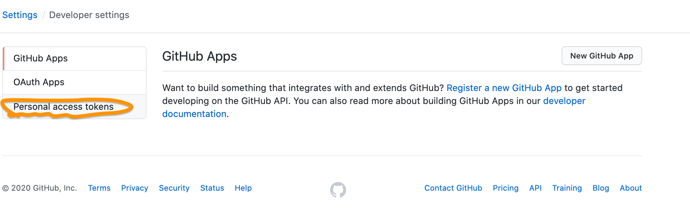
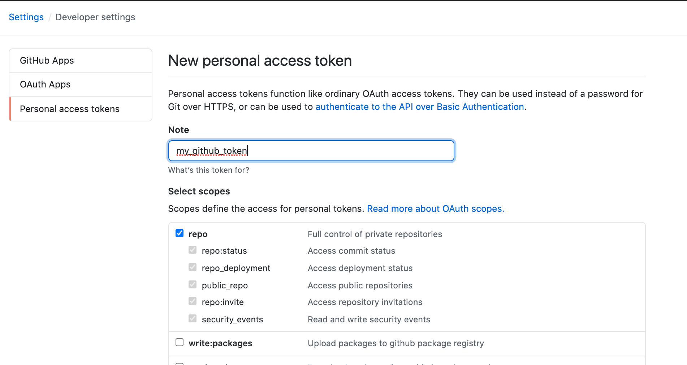
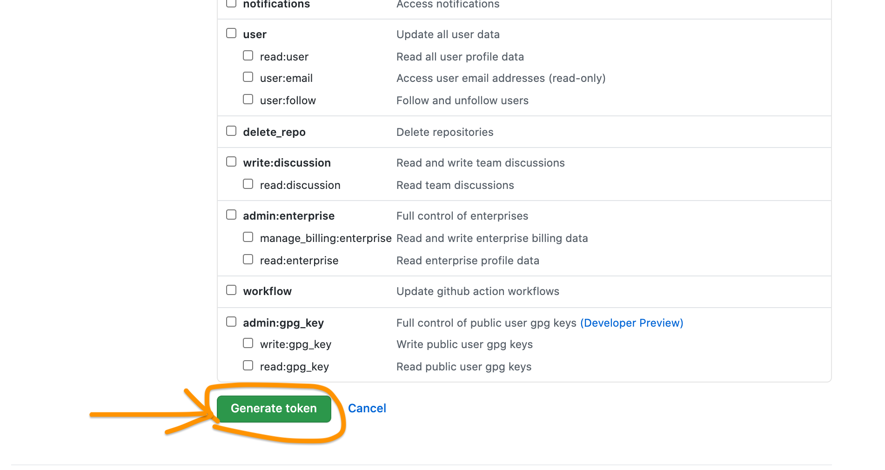

# Introduction of Data Extraction with GitHub API

# What is an API?
API is the acronym for Application Programming Interface, which is a software intermediary that allows two applications to talk to each other. The GitHub API is provided by GitHub for developers who want to develop applications targeting GitHub.

# Get your token
If you want to extract more data without limitation, you need to create a token from GitHub. Proceed as follows：
- Step 1: Login GitHub with your user name and password

- Step 2: Click your icon on the right top and click “settings”

- Step 3: Scroll down and click “Developer settings”

- Step 4: Click “personal access token” on a new page then click “Generate New Token”

- Step 5: It will require your GitHub password

- Step 6: After you enter your password you can see a new page, and on the top, you can see “Note”. Here you can name your token and select the appropriate scopes.

- Step 7: Scroll down to the bottom and click “Generate Token”, then you can get you token on a new page.

# Code in Python
You can click the Jupter Notebook -GitHub_Api_Project.ipynb above in this repo.
